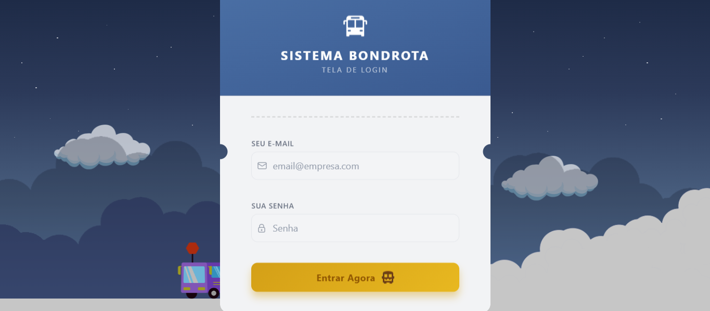
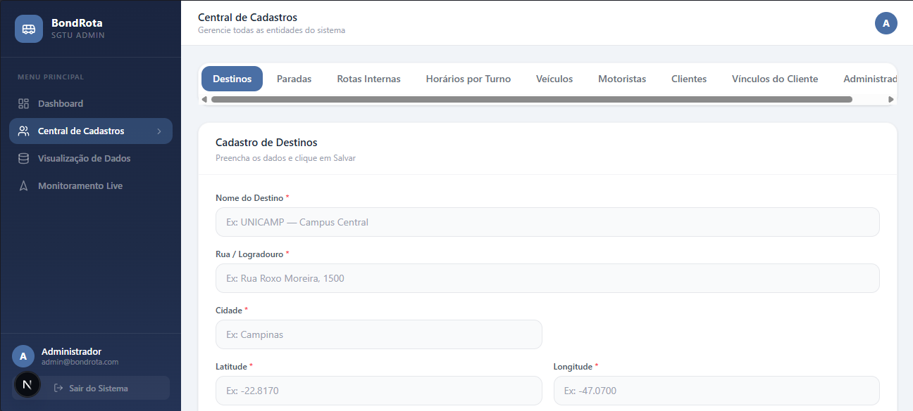
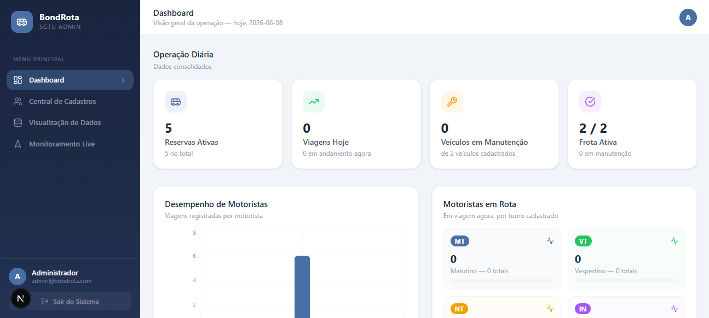
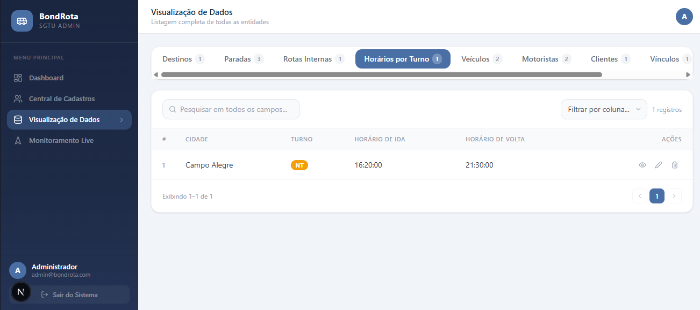

# BondRota

Plataforma web de gestão de transporte universitário, construída com **Next.js**, **TypeScript**, **Tailwind CSS** e **Firebase**.

O sistema oferece um painel administrativo completo para operações de transporte, permitindo o cadastro e acompanhamento de motoristas, veículos, clientes, rotas, paradas, destinos e reservas, além do monitoramento de viagens em tempo real.

## Funcionalidades

- **Login com tema de embarque** — tela de autenticação inspirada em um bilhete de viagem.
- **Dashboard analítico** — indicadores de frota, ocupação, turnos (matutino/vespertino/noturno), comodidades dos veículos e desempenho de viagens, com gráficos interativos (Recharts).
- **Central de Cadastros** — gestão de motoristas, veículos, clientes, rotas internas, paradas e destinos.
- **Visualização de Dados** — relatórios e indicadores operacionais.
- **Monitoramento ao vivo** — acompanhamento de viagens e localização dos veículos em mapa interativo (Leaflet/React-Leaflet).

## Stack

- [Next.js](https://nextjs.org) (App Router) + React 19 + TypeScript
- Tailwind CSS
- Firebase (autenticação e dados)
- Recharts (gráficos)
- Leaflet / React-Leaflet (mapas)

## Como rodar localmente

```bash
npm install
npm run dev
```

Acesse [http://localhost:3000](http://localhost:3000) no navegador.

> É necessário configurar as variáveis de ambiente (chaves do Firebase e URL da API) em um arquivo `.env`.

## Fotos 








